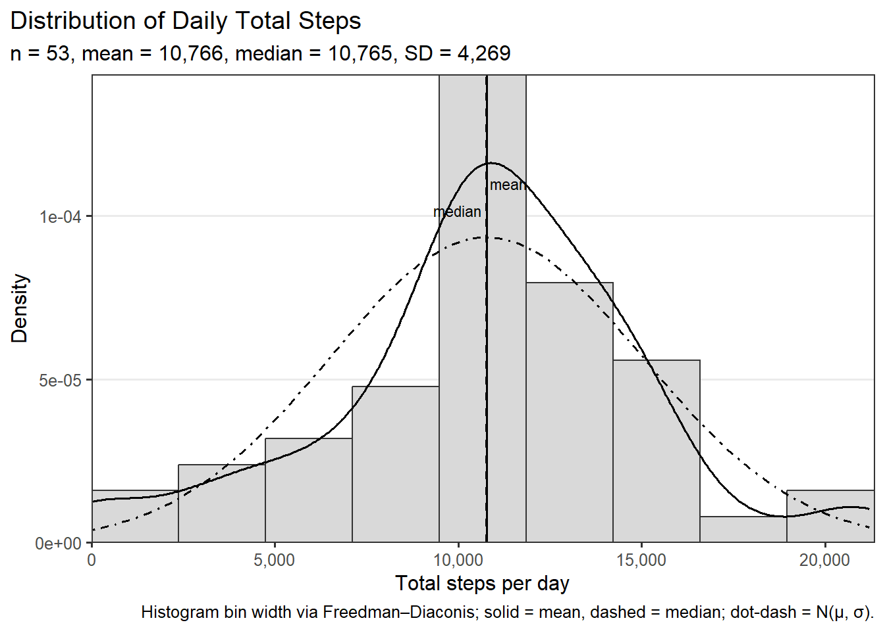
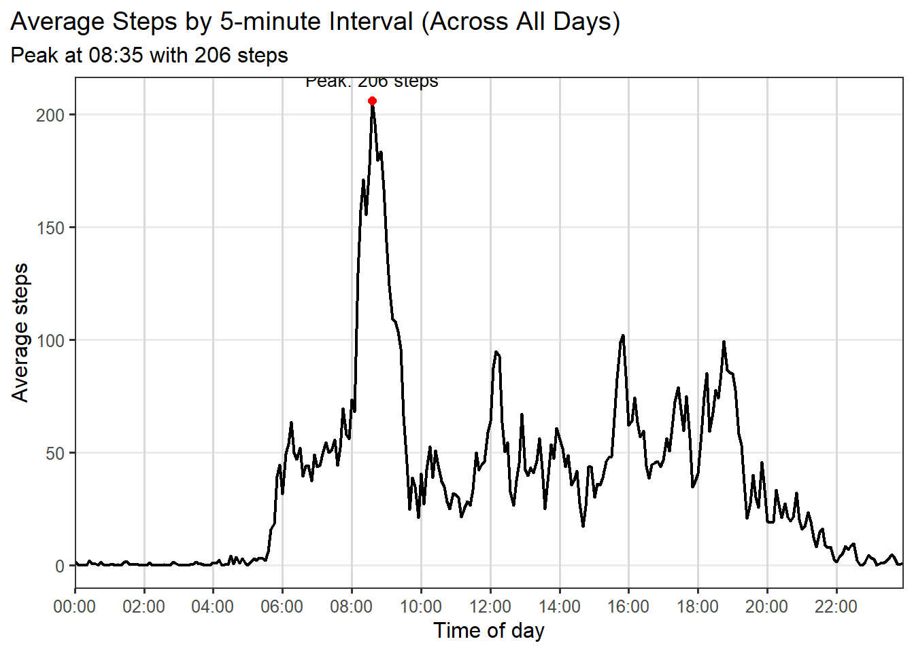
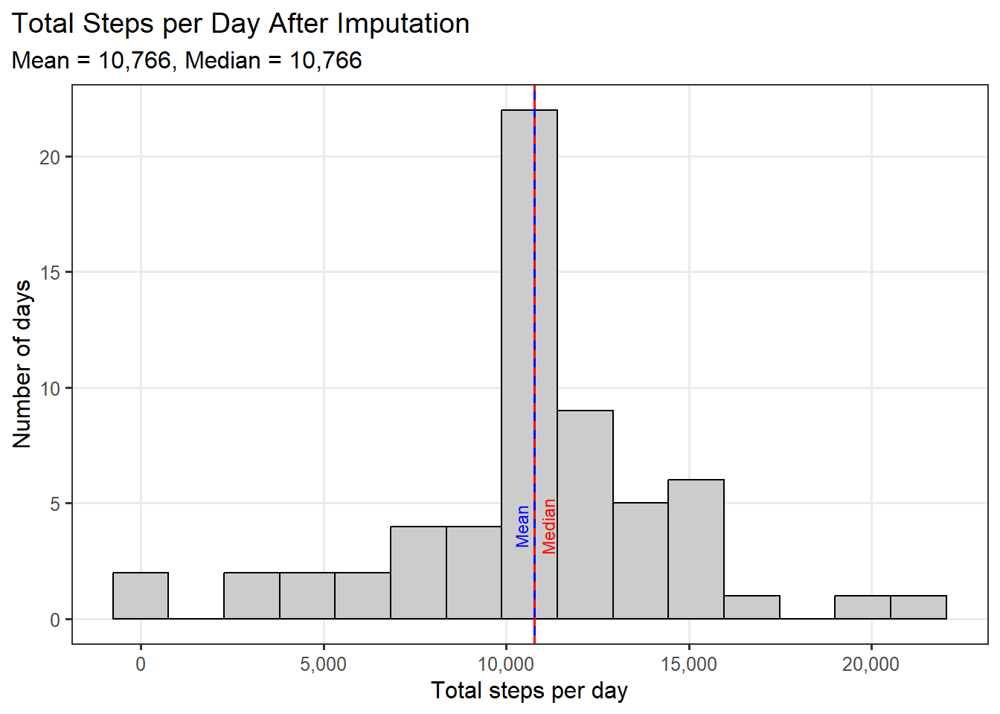
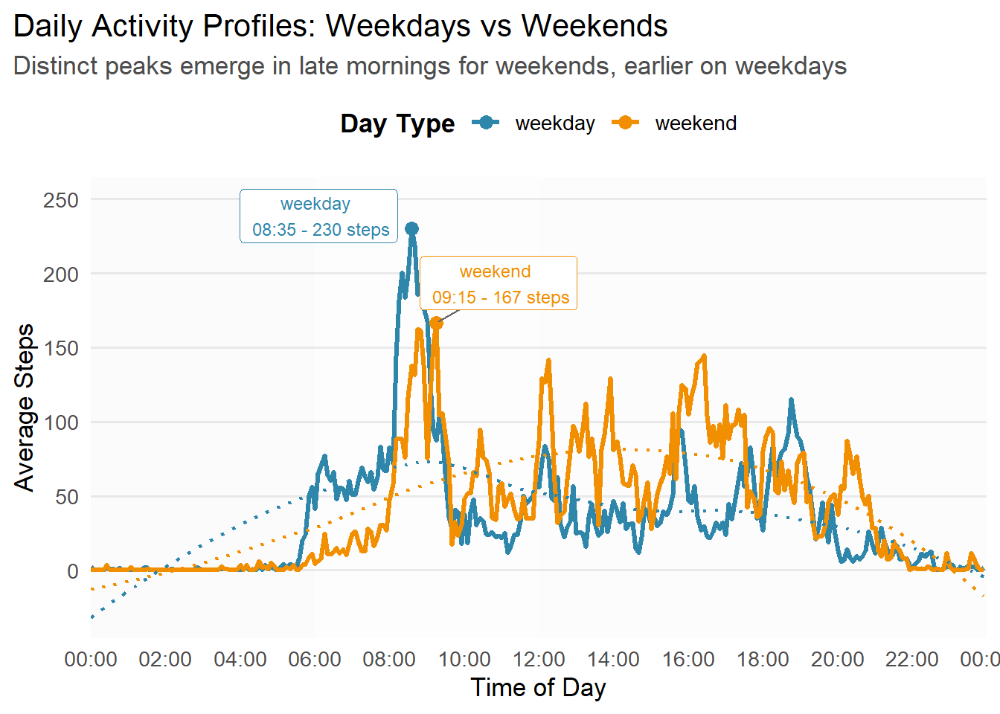
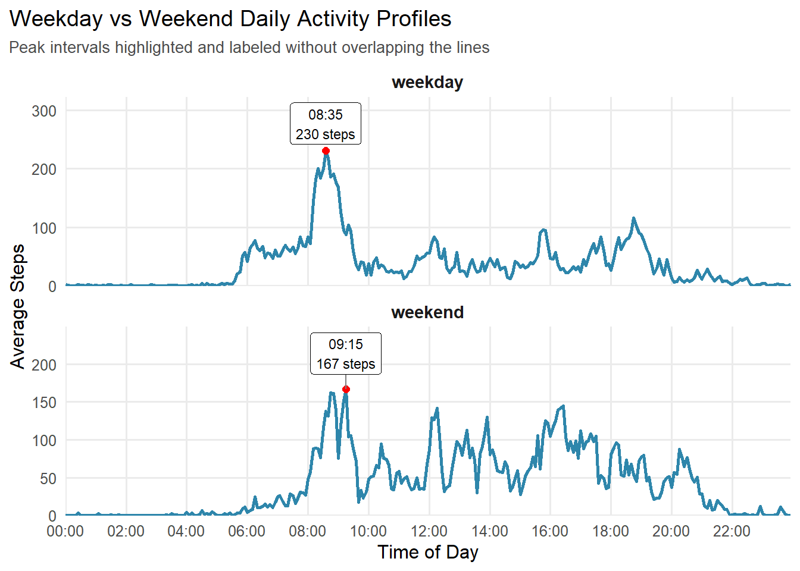

``` r
knitr::opts_chunk$set(echo = TRUE, message = FALSE, warning = FALSE, fig.path = "figure/")
```

``` r
# Core tidyverse + dates + tables
library(tidyverse)
library(lubridate)
library(knitr)
library(scales)   # nice axis formatting
library(ggrepel)

# Repro note
set.seed(123)
```

``` r
# Helper: prefer CSV; fall back to ZIP -> CSV
csv_path <- "activity.csv"
zip_path <- "repdata_data_activity.zip"

if (!file.exists(csv_path) && file.exists(zip_path)) {
  unzip(zip_path, files = "activity.csv", overwrite = TRUE)
}

stopifnot(file.exists(csv_path))

activity <- readr::read_csv(
  csv_path,
  col_types = cols(
    steps    = col_double(),
    date     = col_date(format = "%Y-%m-%d"),
    interval = col_integer()
  )
)

# Quick sanity checks
n_obs <- nrow(activity)
n_na  <- sum(is.na(activity$steps))
data_summary <- tibble(
  n_rows = n_obs,
  n_missing_steps = n_na,
  date_min = min(activity$date, na.rm = TRUE),
  date_max = max(activity$date, na.rm = TRUE),
  n_days = n_distinct(activity$date),
  n_intervals = n_distinct(activity$interval)
)
kable(data_summary, caption = "Dataset snapshot & integrity checks")
```

| n_rows | n_missing_steps | date_min   | date_max   | n_days | n_intervals |
|-------:|----------------:|:-----------|:-----------|-------:|------------:|
|  17568 |            2304 | 2012-10-01 | 2012-11-30 |     61 |         288 |

Dataset snapshot & integrity checks

``` r
daily_complete <- activity %>%
  filter(!is.na(steps)) %>%
  group_by(date) %>%
  summarise(total_steps = sum(steps), .groups = "drop")

kable(head(daily_complete), caption = "First rows of daily totals (NAs removed)")
```

| date       | total_steps |
|:-----------|------------:|
| 2012-10-02 |         126 |
| 2012-10-03 |       11352 |
| 2012-10-04 |       12116 |
| 2012-10-05 |       13294 |
| 2012-10-06 |       15420 |
| 2012-10-07 |       11015 |

First rows of daily totals (NAs removed)

``` r
# Assumes daily_complete$total_steps is numeric and non-missing for the days included
x <- as.numeric(daily_complete$total_steps)
x <- x[is.finite(x)]  # just in case

# Descriptives
n   <- length(x)
mu  <- mean(x)
med <- median(x)
sdx <- sd(x)
iqr <- IQR(x)

# Freedman–Diaconis bin width (robust, paper-friendly choice)
bw_fd <- 2 * iqr / (n^(1/3))
if (!is.finite(bw_fd) || bw_fd <= 0) bw_fd <- diff(range(x)) / 30  # fallback

# For placing annotations nicely
dobj  <- density(x)
y_max <- max(dobj$y)

ggplot(daily_complete, aes(x = total_steps)) +
  # Histogram as density to compare with curves
  geom_histogram(
    aes(y = after_stat(density)),
    binwidth = bw_fd, boundary = 0,
    fill = "grey85", color = "grey20"
  ) +
  # Kernel density estimate
  geom_density(linewidth = 0.7) +
  # Normal reference curve with sample mean & sd
  stat_function(fun = ~ dnorm(., mean = mu, sd = sdx),
                linetype = "dotdash", linewidth = 0.6) +
  # Mean & median markers
  geom_vline(xintercept = mu,  linetype = "solid",  linewidth = 0.6) +
  geom_vline(xintercept = med, linetype = "dashed", linewidth = 0.6) +
  annotate("text", x = mu,  y = 0.92*y_max, label = "mean",
           vjust = -0.3, hjust = -0.1, size = 3) +
  annotate("text", x = med, y = 0.85*y_max, label = "median",
           vjust = -0.3, hjust =  1.1, size = 3) +
  labs(
    title = "Distribution of Daily Total Steps",
    subtitle = sprintf("n = %d, mean = %s, median = %s, SD = %s",
                       n, comma(mu), comma(med), comma(sdx)),
    x = "Total steps per day",
    y = "Density",
    caption = "Histogram bin width via Freedman–Diaconis; solid = mean, dashed = median; dot-dash = N(μ, σ)."
  ) +
  scale_x_continuous(labels = label_number(big.mark = ",")) +
  coord_cartesian(expand = FALSE) +
  theme_bw(base_size = 12) +
  theme(
    panel.grid.major.x = element_blank(),
    panel.grid.minor   = element_blank(),
    plot.title.position = "plot"
  )
```



``` r
daily_stats <- daily_complete %>%
  summarise(
    mean_total   = mean(total_steps),
    median_total = median(total_steps)
  )
kable(daily_stats, digits = 1, caption = "Mean and median daily steps (ignoring NAs)")
```

| mean_total | median_total |
|-----------:|-------------:|
|    10766.2 |        10765 |

Mean and median daily steps (ignoring NAs)

``` r
interval_avg <- activity %>%
  filter(!is.na(steps)) %>%
  group_by(interval) %>%
  summarise(mean_steps = mean(steps), .groups = "drop")

kable(head(interval_avg), digits = 2, caption = "First rows: average steps by 5-min interval")
```

| interval | mean_steps |
|---------:|-----------:|
|        0 |       1.72 |
|        5 |       0.34 |
|       10 |       0.13 |
|       15 |       0.15 |
|       20 |       0.08 |
|       25 |       2.09 |

First rows: average steps by 5-min interval

``` r
library(ggplot2)
library(dplyr)
library(scales)

# Convert interval to minutes & then to POSIX time-of-day
interval_avg <- interval_avg %>%
  mutate(
    minutes = (interval %/% 100) * 60 + (interval %% 100),
    time = as.POSIXct(sprintf("%02d:%02d", minutes %/% 60, minutes %% 60),
                      format = "%H:%M", tz = "UTC")
  )

# Find peak interval
peak <- interval_avg %>% slice_max(mean_steps, n = 1, with_ties = FALSE)

ggplot(interval_avg, aes(x = time, y = mean_steps)) +
  geom_line(linewidth = 0.8) +
  geom_point(data = peak, aes(x = time, y = mean_steps), color = "red", size = 2) +
  geom_text(
    data = peak,
    aes(x = time, y = mean_steps, label = paste0("Peak: ", comma(round(mean_steps)), " steps")),
    vjust = -1, hjust = 0.5, size = 3.5
  ) +
  labs(
    title = "Average Steps by 5-minute Interval (Across All Days)",
    subtitle = sprintf("Peak at %s with %s steps",
                       format(peak$time, "%H:%M"),
                       comma(round(peak$mean_steps))),
    x = "Time of day",
    y = "Average steps"
  ) +
  scale_x_datetime(
    date_labels = "%H:%M",
    breaks = date_breaks("2 hour"),
    expand = expansion(mult = c(0, 0))
  ) +
  scale_y_continuous(labels = comma) +
  theme_bw(base_size = 12) +
  theme(
    panel.grid.minor = element_blank(),
    panel.grid.major.x = element_line(color = "grey85"),
    plot.title.position = "plot"
  )
```



``` r
interval_max <- interval_avg %>% slice_max(mean_steps, n = 1, with_ties = FALSE)
kable(interval_max, digits = 2, caption = "Interval with maximum average steps")
```

| interval | mean_steps | minutes | time                |
|---------:|-----------:|--------:|:--------------------|
|      835 |     206.17 |     515 | 2025-08-15 08:35:00 |

Interval with maximum average steps

``` r
n_missing <- sum(is.na(activity$steps))
kable(tibble(missing_steps = n_missing), caption = "Total number of missing step values")
```

| missing_steps |
|--------------:|
|          2304 |

Total number of missing step values

``` r
# Join interval means and fill NAs
activity_imp <- activity %>%
  left_join(interval_avg, by = "interval") %>%
  mutate(steps = if_else(is.na(steps), mean_steps, steps)) %>%
  select(steps, date, interval)  # drop helper col

# Sanity check: No NAs should remain in steps
sum(is.na(activity_imp$steps))
```

    ## [1] 0

``` r
daily_imp <- activity_imp %>%
  group_by(date) %>%
  summarise(total_steps = sum(steps), .groups = "drop")
```

``` r
# Freedman–Diaconis bin width for better histogram representation
x <- daily_imp$total_steps
bw_fd <- 2 * IQR(x) / length(x)^(1/3)
if (!is.finite(bw_fd) || bw_fd <= 0) bw_fd <- diff(range(x)) / 30

# Stats for annotation
mean_imp  <- mean(daily_imp$total_steps)
median_imp <- median(daily_imp$total_steps)

# Histogram 
ggplot(daily_imp, aes(x = total_steps)) +
  geom_histogram(binwidth = bw_fd, fill = "grey80", color = "black") +
  geom_vline(xintercept = mean_imp, color = "blue", linewidth = 0.7) +
  geom_vline(xintercept = median_imp, color = "red", linetype = "dashed", linewidth = 0.7) +
  annotate("text", x = mean_imp, y = 4, label = "Mean", color = "blue", angle = 90, vjust = -0.5, size = 3) +
  annotate("text", x = median_imp, y = 4, label = "Median", color = "red", angle = 90, vjust = 1.5, size = 3) +
  labs(
    title = "Total Steps per Day After Imputation",
    subtitle = sprintf("Mean = %s, Median = %s",
                       comma(round(mean_imp)), comma(round(median_imp))),
    x = "Total steps per day",
    y = "Number of days"
  ) +
  scale_x_continuous(labels = comma) +
  theme_bw(base_size = 12) +
  theme(
    panel.grid.minor = element_blank(),
    plot.title.position = "plot"
  )
```



``` r
# Comparison table 
compare_stats <- tibble(
  Dataset = c("Ignoring NAs", "After Imputation"),
  Mean    = c(mean(daily_complete$total_steps),
              mean(daily_imp$total_steps)),
  Median  = c(median(daily_complete$total_steps),
              median(daily_imp$total_steps))
)

kable(compare_stats, digits = 1, caption = "Comparison of Mean and Median Daily Steps")
```

| Dataset          |    Mean |  Median |
|:-----------------|--------:|--------:|
| Ignoring NAs     | 10766.2 | 10765.0 |
| After Imputation | 10766.2 | 10766.2 |

Comparison of Mean and Median Daily Steps

``` r
activity_imp <- activity_imp %>%
  mutate(
    wd = wday(date, week_start = 1),
    day_type = if_else(wd >= 6, "weekend", "weekday"),
    day_type = factor(day_type, levels = c("weekday", "weekend"))
  ) %>%
  select(-wd)

# Average profile by interval and day type
interval_daytype <- activity_imp %>%
  group_by(day_type, interval) %>%
  summarise(mean_steps = mean(steps), .groups = "drop")

kable(head(interval_daytype), digits = 2, caption = "First rows: average steps by interval & day type")
```

| day_type | interval | mean_steps |
|:---------|---------:|-----------:|
| weekday  |        0 |       2.25 |
| weekday  |        5 |       0.45 |
| weekday  |       10 |       0.17 |
| weekday  |       15 |       0.20 |
| weekday  |       20 |       0.10 |
| weekday  |       25 |       1.59 |

First rows: average steps by interval & day type

``` r
# Convert intervals to time
interval_daytype <- interval_daytype %>%
  mutate(
    minutes = (interval %/% 100) * 60 + (interval %% 100),
    time = as.POSIXct(sprintf("%02d:%02d", minutes %/% 60, minutes %% 60),
                      format = "%H:%M", tz = "UTC")
  )

# Peaks for annotation
peak_points <- interval_daytype %>%
  group_by(day_type) %>%
  slice_max(mean_steps, n = 1, with_ties = FALSE)

# Corporate-style colors
cols <- c("weekday" = "#2E86AB", "weekend" = "#F18F01")

ggplot(interval_daytype, aes(x = time, y = mean_steps, color = day_type)) +
  # Shaded time-of-day bands
  annotate("rect", xmin = as.POSIXct("00:00", format = "%H:%M", tz = "UTC"),
           xmax = as.POSIXct("06:00", format = "%H:%M", tz = "UTC"),
           ymin = -Inf, ymax = Inf, alpha = 0.05, fill = "grey70") +
  annotate("rect", xmin = as.POSIXct("06:00", format = "%H:%M", tz = "UTC"),
           xmax = as.POSIXct("12:00", format = "%H:%M", tz = "UTC"),
           ymin = -Inf, ymax = Inf, alpha = 0.05, fill = "grey85") +
  annotate("rect", xmin = as.POSIXct("12:00", format = "%H:%M", tz = "UTC"),
           xmax = as.POSIXct("18:00", format = "%H:%M", tz = "UTC"),
           ymin = -Inf, ymax = Inf, alpha = 0.05, fill = "grey80") +
  annotate("rect", xmin = as.POSIXct("18:00", format = "%H:%M", tz = "UTC"),
           xmax = as.POSIXct("24:00", format = "%H:%M", tz = "UTC"),
           ymin = -Inf, ymax = Inf, alpha = 0.05, fill = "grey75") +
  
  # Activity lines
  geom_line(linewidth = 1.2) +
  geom_smooth(se = FALSE, linetype = "dotted", linewidth = 0.8, alpha = 0.6) +
  
  # Peak markers
  geom_point(data = peak_points, size = 3) +
  geom_label_repel(
    data = peak_points,
    aes(label = paste(day_type, "\n", format(time, "%H:%M"), "-", comma(round(mean_steps)), "steps")),
    size = 3.2, nudge_y = 20, show.legend = FALSE,
    box.padding = 0.4, segment.color = "grey40"
  ) +
  
  scale_x_datetime(
    date_labels = "%H:%M",
    breaks = date_breaks("2 hours"),
    expand = expansion(mult = c(0, 0))
  ) +
  scale_y_continuous(labels = comma) +
  scale_color_manual(values = cols) +
  
  labs(
    title = "Daily Activity Profiles: Weekdays vs Weekends",
    subtitle = "Distinct peaks emerge in late mornings for weekends, earlier on weekdays",
    x = "Time of Day",
    y = "Average Steps",
    color = "Day Type"
  ) +
  
  theme_minimal(base_size = 13) +
  theme(
    legend.position = "top",
    legend.title = element_text(face = "bold"),
    panel.grid.minor = element_blank(),
    panel.grid.major.x = element_blank(),
    plot.title.position = "plot",
    plot.subtitle = element_text(color = "grey30")
  )
```



``` r
# Convert interval to time-of-day
interval_daytype <- interval_daytype %>%
  mutate(
    minutes = (interval %/% 100) * 60 + (interval %% 100),
    time = as.POSIXct(sprintf("%02d:%02d", minutes %/% 60, minutes %% 60),
                      format = "%H:%M", tz = "UTC")
  )

# Identify peak points for annotation
peak_points <- interval_daytype %>%
  group_by(day_type) %>%
  slice_max(mean_steps, n = 1, with_ties = FALSE)

# Plot with extra padding and adjusted label positions
ggplot(interval_daytype, aes(x = time, y = mean_steps)) +
  geom_line(linewidth = 1, color = "#2E86AB") +
  geom_point(data = peak_points, color = "red", size = 2) +
  geom_label_repel(
    data = peak_points,
    aes(label = paste0(format(time, "%H:%M"), "\n", round(mean_steps), " steps")),
    size = 3, color = "black", fill = "white", label.size = 0.2,
    nudge_y = 50,           # push labels well above the point
    direction = "y",        # only move vertically
    segment.color = "grey50",
    segment.curvature = -0.1
  ) +
  facet_wrap(~ day_type, ncol = 1, scales = "free_y") +
  scale_x_datetime(
    date_labels = "%H:%M",
    breaks = date_breaks("2 hour"),
    expand = expansion(mult = c(0, 0))
  ) +
  scale_y_continuous(labels = comma, expand = expansion(mult = c(0, 0.15))) + # extra 15% headroom
  labs(
    title = "Weekday vs Weekend Daily Activity Profiles",
    subtitle = "Peak intervals highlighted and labeled without overlapping the lines",
    x = "Time of Day",
    y = "Average Steps"
  ) +
  theme_minimal(base_size = 12) +
  theme(
    strip.text = element_text(face = "bold", size = 11),
    panel.grid.minor = element_blank(),
    plot.title.position = "plot",
    plot.subtitle = element_text(color = "grey30", size = 10)
  )
```


